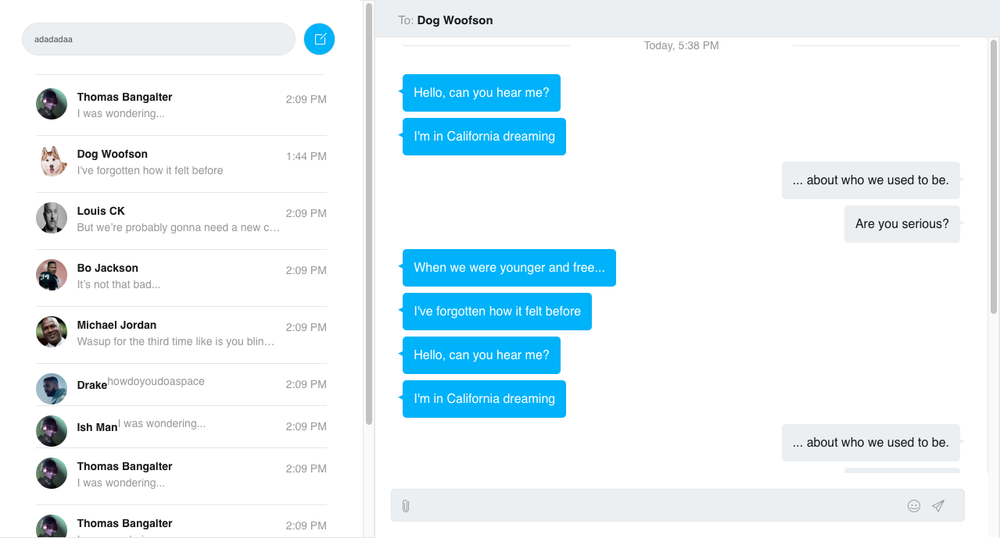

## Static Chat UI Built with React 

##Preview

### Make own copy

First clone the repository using:

    git clone https://github.com/ishraqe/React-Chat-UI

Then install the dependencies using:

    yarn

After that start application with:

    yarn start

To build:

    yarn run build

After that you will get a build folder. Paste it in your websites document root. voila!!